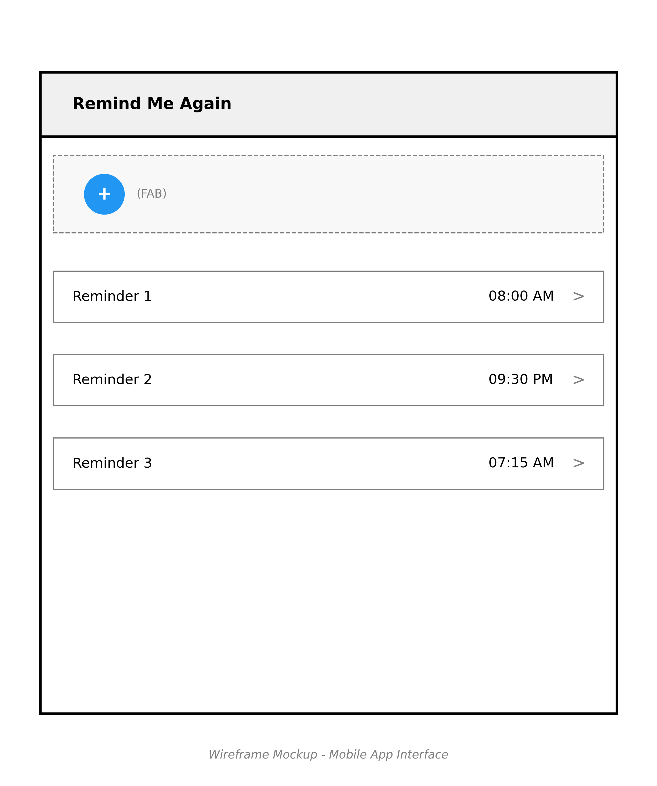
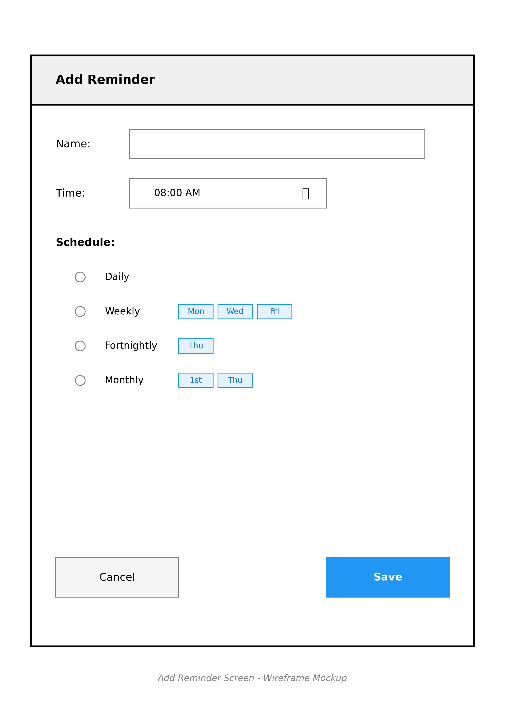
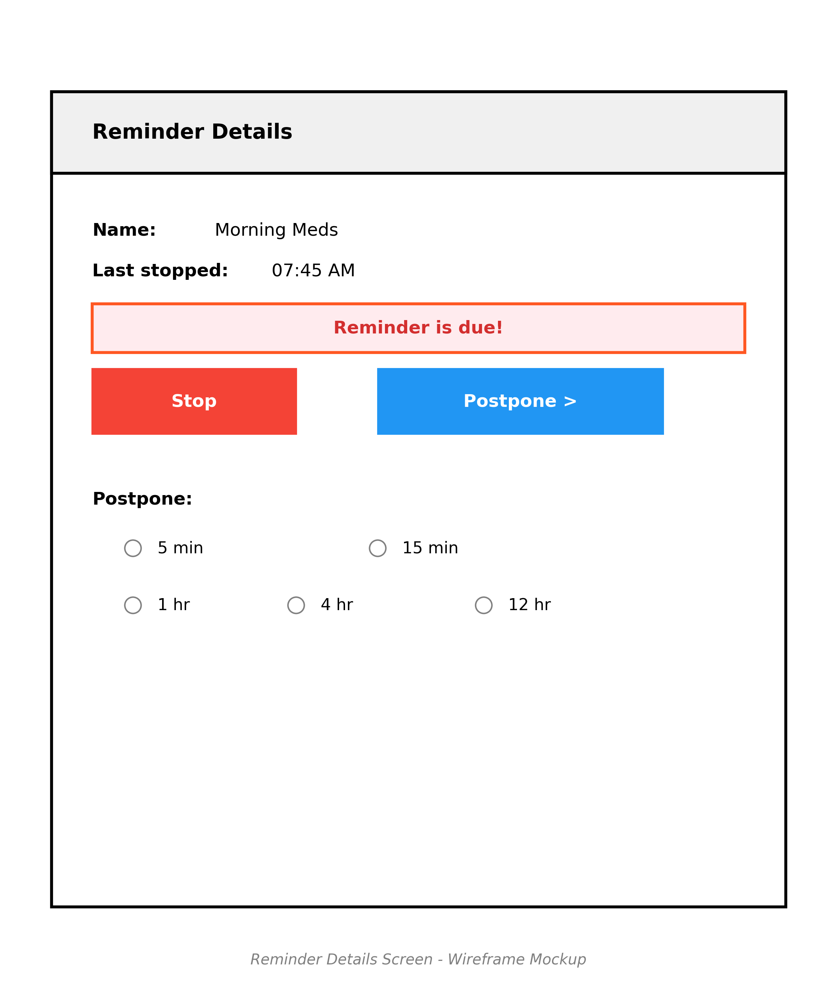
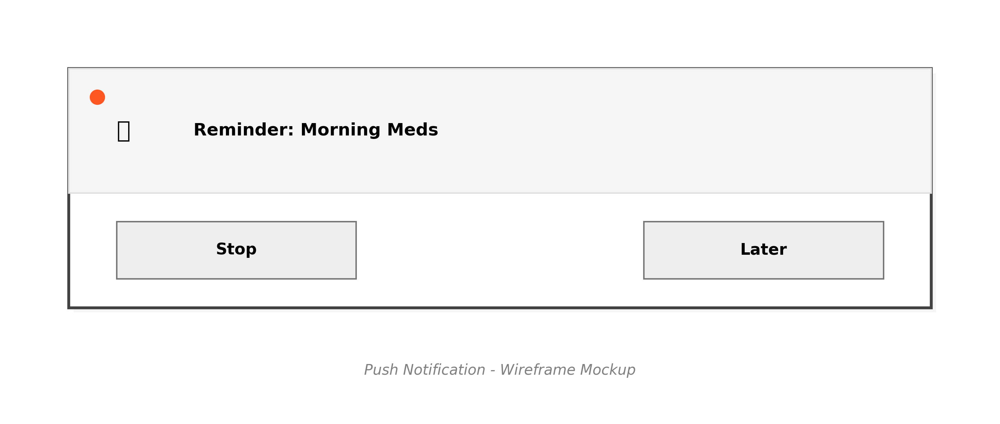

Design: Remind Me Again (Android)
=================================

Overview
--------

Remind Me Again is an Android app for recurring reminders. It allows
users to create, edit, and manage reminders with flexible schedules and
receive timely notifications.

Guiding Principles
------------------

Remind Me Again is an offline, local-only app.

The UI is clean and minimalist.

Technical Design Decisions
-------------------------

1. **Data Layer & Persistence**
   - Use Kotlin Coroutines for asynchronous database operations
   - RoomDatabase classes are versioned with RoomDatabase.Migration objects
   - All migrations must be covered by migration tests
   - Schema changes are documented using Room's exportSchema = true
   - Repository pattern used to abstract data source

2. **Architecture Pattern**
   - MVI architecture using StateFlow for unidirectional state management

3. **Dependency Injection**
   - Koin for Kotlin-friendly dependency injection

4. **UI Implementation**
   - Jetpack Compose for modern design and UI quality
   - LazyColumn for lists
   - TimePicker: Material3 TimePicker
   - Schedule selection: Material3 Chips without custom animations

5. **Background Work & Scheduling**
   - WorkManager's periodic work with 5-minute minimum interval
   - Accommodates battery optimization
   - No foreground service required

6. **Testing Strategy**
   - JUnit4 for unit tests
   - Espresso for UI testing
   - Integration tests for database and WorkManager

7. **Error Handling**
   - No centralized error handling system
   - No network error handling required
   - No retry mechanisms needed

8. **Localization**
   - Initial implementation: English only
   - Time: 24-hour format
   - Dates: ISO 8601 format
   - Days: Three-letter abbreviations (e.g., Tue 2025-06-17 19:30)
   - No RTL support in initial implementation

9. **Accessibility**
   - Basic TalkBack support only
   - No custom accessibility actions required

10. **Edge Cases**
    - Handles device reboots
    - Times are local (e.g., 13:00 remains 13:00 across time zones)
    - Post-update reminder notifications
    - DST handling:
      - Double-occurring times: Notify at first occurrence
      - Skipped times: Notify at next hour

11. **Performance**
    - No pagination required for reminder lists

12. **Analytics & Monitoring**
    - No crash reporting
    - No usage analytics
    - No completion tracking

App Navigation & Screen Flow
----------------------------

1. **Reminder List Screen**
   - Shows all reminders.
   - "+" FloatingActionButton to add a new reminder.
   - Tap a reminder to edit.
   - Tap notification to open "Show Reminder" screen.

   ```plaintext
   +--------------------------------------+
   | Remind Me Again                      |
   | +----------------------------------+ |
   | | + (FAB)                          | |  <-- FloatingActionButton (top left)
   | +----------------------------------+ |
   |                                      |
   | [ Reminder 1              08:00  > ] |
   | [ Reminder 2              21:30  > ] |  <-- LazyColumn list items
   | [ Reminder 3              07:15  > ] |
   |                                      |
   +--------------------------------------+
   ```

   

2. **Add/Edit Reminder Screen**
   - Fields: Name (EditText), Time (TimePicker), Schedule (custom UI).
   - Save/Cancel buttons.

   ```plaintext
   +--------------------------------------+
   | Add Reminder                         |
   |--------------------------------------|
   | Name: [______________]               |  <-- EditText
   | Time: [ 08:00 AM   ⏰ ]               |  <-- TimePicker
   | Schedule:                            |
   |   ( ) Daily                          |
   |   ( ) Weekly [Mon][Wed][Fri]         |  <-- Chips/Buttons
   |   ( ) Fortnightly [Thu]              |
   |   ( ) Monthly [1st][Thu]             |
   |                                      |
   | [Cancel]         [Save]              |  <-- Buttons
   +--------------------------------------+
   ```

   

3. **Show Reminder Screen**
   - Shows reminder details.
   - If due: "Stop" and "Postpone" actions.

   ```plaintext
   +--------------------------------------+
   | Reminder Details                     |
   |--------------------------------------|
   | Name: Morning Meds                   |
   | Last stopped: 07:45 AM               |
   |                                      |
   | [ Reminder is due! ]                 |
   | [ Stop ]   [ Postpone > ]            |  <-- Buttons
   |                                      |
   | Postpone:                            |
   |   ( ) 5 min   ( ) 15 min             |  <-- RadioGroup
   |   ( ) 1 hr    ( ) 4 hr   ( ) 12 hr   |
   +--------------------------------------+
   ```

   

4. **Notification**
   - Appears when a reminder is due.
   - Shows name, "Stop", and "Later" actions.

   ```plaintext
   +--------------------------------------+
   | 🔔 Reminder: Morning Meds             |
   |--------------------------------------|
   | [ Stop ]   [ Later ]                 |  <-- Notification actions
   +--------------------------------------+
   ```

   


UI Elements & Layouts
---------------------

- **Reminder List:** LazyColumn, FloatingActionButton.
- **Add/Edit Reminder:** EditText, TimePicker, Spinner/Chips for schedule, Buttons.
- **Show Reminder:** TextView, Buttons, RadioGroup.
- **Notification:** Android Notification with actions.

Data Model
----------

| Class             | Fields                                      |
|-------------------|---------------------------------------------|
| Reminder          | id (int), name (string), time (time), schedule (ReminderSchedule) |
| ReminderAction    | id (int), reminderId (int, FK), lastActionId (int, nullable, FK) |
| StopAction        | id (int, FK), timestamp (datetime)          |
| PostponeAction    | id (int, FK), timestamp (datetime), intervalSeconds (int) |

- Use Room for local storage.

ReminderSchedule
----------------

- Daily
- Weekly (one or more days)
- Fortnightly (every two weeks, single day)
- Monthly (by day of month or nth weekday)

Notification Behavior
---------------------

- Uses AlarmManager/WorkManager for scheduling.
- Notification includes reminder name, "Stop", and "Later" actions.
- "Later" doubles the postpone interval each time (1, 2, 4, ... minutes).

Permissions & Background Work
----------------------------

- Request `POST_NOTIFICATIONS` (Android 13+).
- Use WorkManager for reliable background scheduling.

Accessibility & Localization
----------------------------

- Support TalkBack and large text.
- Strings in `strings.xml` for localization.

Error Handling & Testing
------------------------

- Show error messages via Snackbar
- Unit tests using JUnit5
- UI tests using Espresso
- Integration tests for database and WorkManager
- Database migrations must be covered by tests
- Domain logic must be covered by tests
- UI functionality must be covered by tests

Edge Cases
----------

- Handle device reboot (reschedule reminders)
- Handle time zone changes:
  - Times remain local (e.g., 13:00 stays 13:00 across time zones)
  - DST double-occurring times: Notify at first occurrence
  - DST skipped times: Notify at next hour
- Handle app updates (notify immediately after update)
